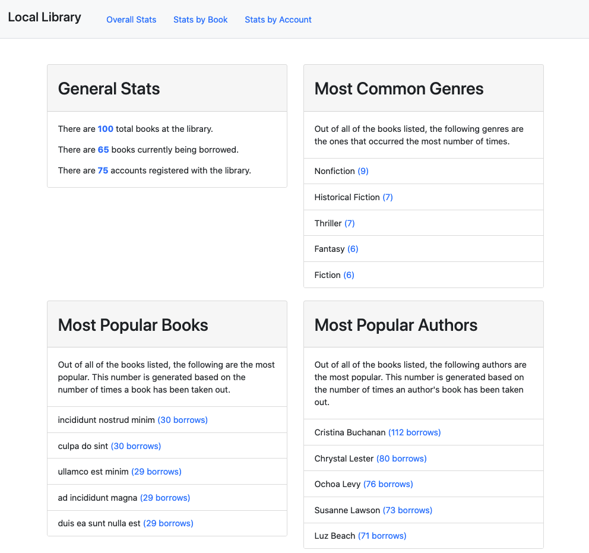
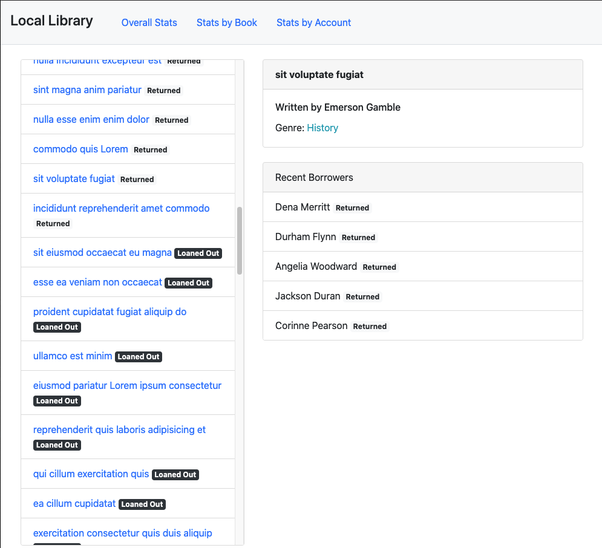
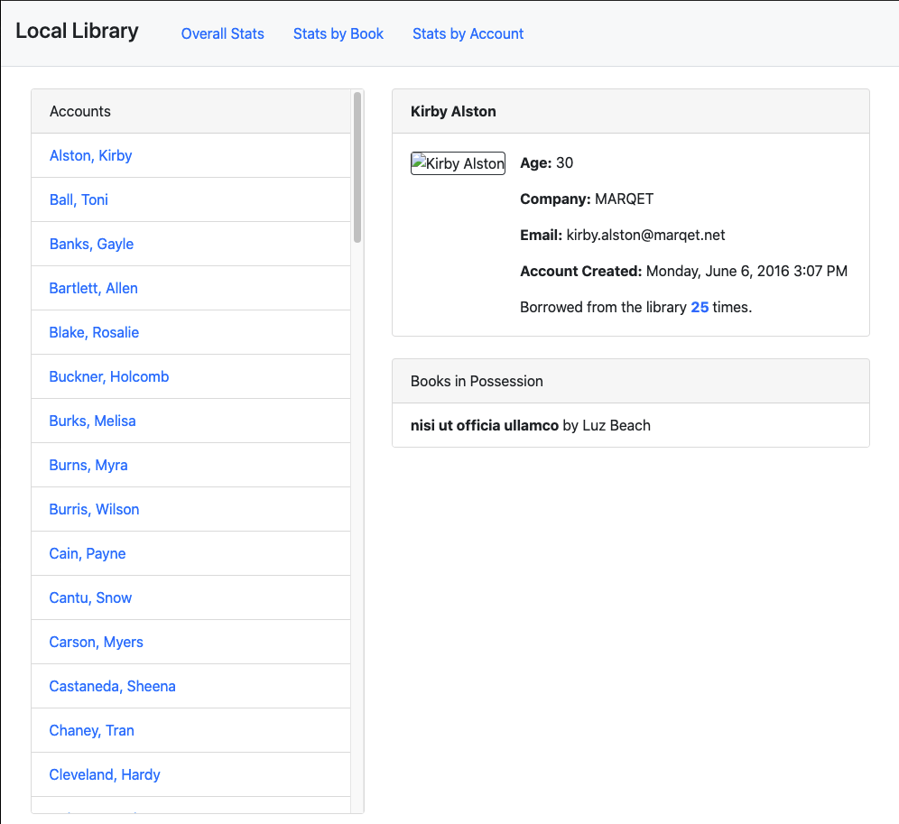

# Local Library

Local Library allows users to more easily access and retrieve information on library accounts, books, and authors.

## Link

[Local library Link](https://meleciosilva.github.io/project-local-library)

## Getting Started

### Overall Stats

- This page displays general stats on the total number of books at the library, how many books are currently borrowed, and how many library users are registered with the library
- Additionally, stats on the most common generes of books, most popular books, and most popular authors are listed

### Stats by Book

- This page lists all of the library's books with their current status (returned or loaned out)
- Each book listing contains additional information, including the author, genre, and recent borrowers

### Stats by Account

- This page lists all of the accounts at the library
- Each account listing contains additional information including the account holder's name, company, email, date of registration, total number of borrows, and current books in possession

## Technology

- Built with JavaScript
- Used and assortment of operators (arithmetic, assignment, comparison type), conditional statements, and loops to enhance functionality
- Implemented several JavaScript array methods (some(), find(), filter(), map(), indexOf(), join(), reduce(), split(), etc.) to manipulate and access data
- Applied object shorthand, destructuring techniques, and spread operators where applicable to simplify code and enhance readability
